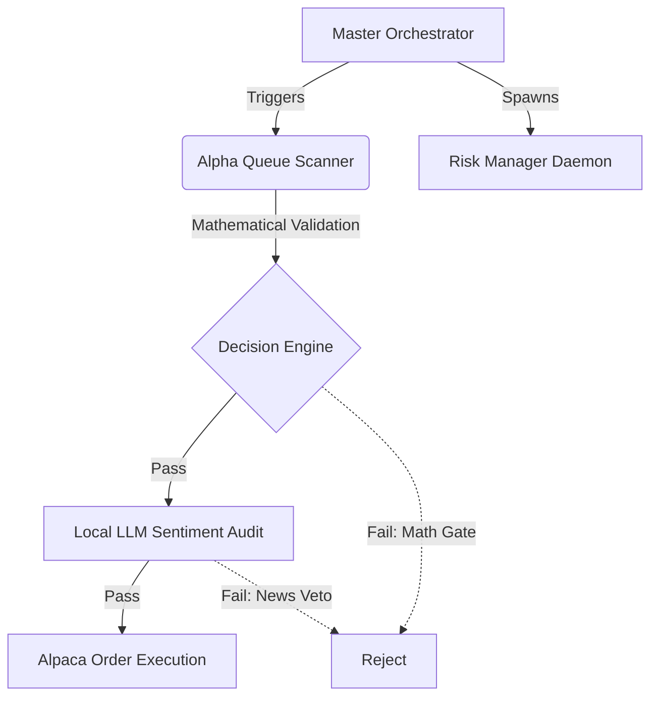

<div align="center">
  
# 🤖 AI TRADING BOT
### Autonomous Quantitative & Local LLM Arbitrage Engine

[](https://www.python.org/downloads/release/python-3100/)
[]()
[]()
[]()
[](https://opensource.org/licenses/MIT)

*An autonomous, multi-modal quantitative trading engine designed to outmaneuver standard retail execution using classical arbitrage and adversarial LLM sentiment analysis.*

</div>

---

## 💼 Investment Thesis (Funding & Scalability)

Unlike rudimentary indicator bots, this system fuses classical quantitative arbitrage (Pairs Trading, O-U mean reversion) with cutting-edge Local LLM sentiment analysis (Llama 70B). 

- **Intelligent Risk Allocation:** It employs a Bayesian self-auditing mechanic to rigorously calculate probabilities before capital deployment.
- **Institutional Stability:** The architecture includes hard-coded safety gates (correlation vetoes, macro-economic filters, and connection sentinels) to protect capital during black swan events.
- **Defensive Edge:** The engine doesn't just look for entries; it actively finds reasons *not* to trade, preserving capital and generating alpha through rigorous risk management.

---

## 🏗️ System Architecture

The trading bot operates via an asynchronous master orchestrator that manages data ingestion, risk calculation, and market execution.



---

## 🧠 Core Systems & Sentinels

The bot is divided into highly specialized sentinels and engines:

### 📈 Alpha Generation
- **Pairs Arbitrage Scanner**: Scans high-correlation asset pairs (e.g. NVDA vs SOXX) and triggers trades when Z-scores breach standard deviations.
- **Local LLM Sentinel**: Consumes raw numerical order-flow tensors and news headlines via Llama 70B to prevent spoofing and front-running.
- **Regime Classifier**: Determines current market volatility percentiles using ATR to dynamically adjust Stop Loss (SL) and Take Profit (TP) distances.

### 🛡️ Risk Management & Defense
- **Global Sentinel**: Pings macro indicators (DXY, VIX, US10Y). If the environment is hostile (e.g., Yield Spike), it issues a hard veto on directional trades.
- **Connectivity Sentinel**: Subprocesses ping checks to exchange servers, blocking trades if network jitter exceeds 350ms.
- **Asymmetric Entry Optimizer**: Rejects immediate execution at the bid/ask spread, actively hunting for VWAP-anchored prices to secure institutional fills.

---

## 🚀 Quick Start Guide

### 1. Installation
Clone the repository and install the dependencies:
```bash
git clone https://github.com/ragzur123-pixel/aitradingbot.git
cd aitradingbot
pip install -r requirements.txt
```

### 2. Configuration
Copy the sample config and insert your API keys (Alpaca, Polygon, DailyFX):
```bash
cp config.yaml.example config.yaml
```

### 3. Initialize Vector Database
The system uses ChromaDB for its historical research ingestion. Run the data pipeline to build your local embeddings:
```bash
python 1_download_youtube.py
```

### 4. Run the Master Node
Launch the autonomous orchestrator (Runs on an infinite event loop):
```bash
python master_orchestrator.py
```

---

## 📚 Deep Dive Documentation

For a complete breakdown of every file, mathematical formula, and logic gate used in this system, please read the exhaustive [Master Project Index & Mechanics Map](geminidocs/PROJECT_INDEX.md).

<div align="center">
  <br>
  <i>Engineered for zero-latency execution and survival.</i>
</div>
